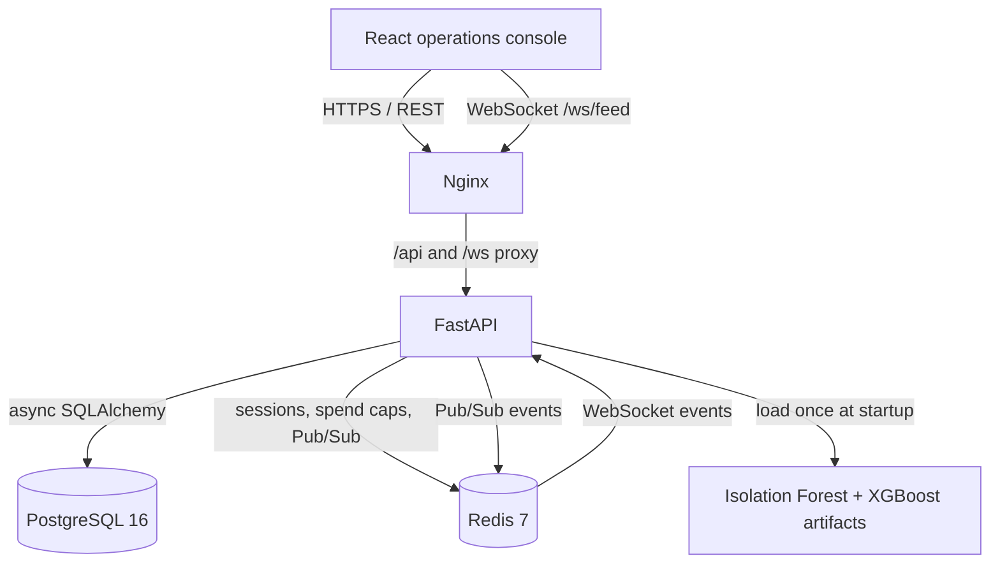

# KAVACH

**A governance console and decisioning API for teams operating autonomous financial agents.**

<p align="center">
  
  
  
  
  
</p>

## Contents

- [Overview](#overview)
- [Architecture](#architecture)
- [Transaction workflow](#transaction-workflow)
- [Capabilities](#capabilities)
- [Repository layout](#repository-layout)
- [Configuration](#configuration)
- [Run locally](#run-locally)
- [API contract](#api-contract)
- [Risk decisioning](#risk-decisioning)
- [Verification](#verification)
- [Scope and safety](#scope-and-safety)

## Overview

Kavach governs transactions submitted by an organisation's autonomous agents. It keeps the agent fleet, policies, transactions, escalations, and audit records in PostgreSQL; Redis provides the low-latency spend-cap cache, session store, and real-time feed transport. A React operations console exposes the same API used by the system.

The important design choice is that model output never replaces hard governance controls. A transaction first passes deterministic policies and agent-status/spend-cap gates. Only then do locally loaded XGBoost and Isolation Forest models assign a risk band of `approve`, `escalate`, or `deny`.

## Architecture



The production-style Compose stack exposes only Nginx on port `8080` by default. Nginx serves the static UI and proxies `/api`, `/ws`, and `/health` to FastAPI.

## Transaction workflow

1. An authenticated `operator` submits a transaction for an agent through `POST /api/v1/transactions`.
2. The API scopes the request to the JWT's organisation and loads the real or sandbox agent fleet selected by the request.
3. The transaction pipeline checks the agent's current status, its rolling spend cap, and active deterministic policies.
4. If a hard governance control fails, the pipeline returns a denial and writes an audit record. Model scoring does not override that result.
5. For transactions that pass those gates, the API derives the shared feature contract and scores it with Isolation Forest and XGBoost artifacts loaded in process.
6. The combined score selects `approve` below `0.30`, `escalate` from `0.30` to below `0.70`, or `deny` at `0.70` and above.
7. The transaction, its decision, and the evaluation trace are persisted; the service publishes feed updates through Redis for connected WebSocket clients.

## Capabilities

- Manage organisation-scoped agent fleets, delegation trees, status, trust scores, and spend caps.
- Revoke a single agent, a subtree, or an entire fleet through the delegation-aware kill switch.
- Create, update, activate, and dry-run deterministic policies with priority ordering.
- Submit governed transactions and inspect the rule-evaluation trace and risk score.
- Review escalated transactions through role-protected escalation actions.
- Verify the integrity of the append-only audit chain and retrieve the implemented NIST control mapping.
- Connect to `/ws/feed` for a JWT-authenticated graph snapshot and subsequent transaction, agent-status, and trust-score updates.
- Start, reset, and trigger a deliberately isolated sandbox fleet for demonstration and testing.

## Repository layout

```text
Kavach/
├── backend/
│   ├── app/routes/          # FastAPI HTTP and WebSocket endpoints
│   ├── app/services/        # Rule engine, scoring, audit, feed and spend-cap logic
│   ├── app/models/          # SQLAlchemy database models
│   ├── alembic/             # Versioned PostgreSQL migrations
│   ├── tests/               # pytest coverage for API and safety behaviour
│   ├── Dockerfile           # Python 3.12 production image
│   └── entrypoint.sh        # Applies migrations before Uvicorn starts
├── frontend/
│   ├── src/                 # React operations console
│   ├── Dockerfile           # Vite build + Nginx runtime image
│   └── nginx.conf           # UI, API, WebSocket and health proxy rules
├── ml/
│   ├── artifacts/           # Served Isolation Forest and XGBoost model artifacts
│   ├── features.py          # Training and serving feature contract
│   └── *.py                 # Dataset, augmentation, training and validation scripts
├── docs/                    # Runbooks and project documentation
├── docker-compose.dev.yml   # PostgreSQL and Redis for local development
└── docker-compose.prod.yml  # Full local production-style stack
```

## Configuration

Copy the tracked template before running the production-style stack:

```powershell
Copy-Item .env.production.example .env.production
```

| Variable | Required | Purpose |
| --- | --- | --- |
| `POSTGRES_USER` | No | PostgreSQL user. Defaults to `kavach` in Compose. |
| `POSTGRES_PASSWORD` | Yes | PostgreSQL password used by the database and backend. Replace the template value. |
| `POSTGRES_DB` | No | Database name. Defaults to `kavach` in Compose. |
| `SECRET_KEY` | Yes | HS256 JWT signing key. Replace the template value. |
| `KAVACH_PORT` | No | Host port for Nginx. Defaults to `8080`. |

The backend also accepts these optional runtime overrides through its `Settings` class: `DATABASE_URL`, `DATABASE_URL_SYNC`, `REDIS_URL`, `ENVIRONMENT`, `DEBUG`, `ACCESS_TOKEN_EXPIRE_MINUTES`, `REFRESH_TOKEN_EXPIRE_DAYS`, `ML_ENABLED`, `ML_ARTIFACTS_DIR`, `ML_THRESHOLD_LOW`, `ML_THRESHOLD_HIGH`, `ML_MAX_HISTORY`, and `SPEND_WINDOW_SECONDS`.

## Run locally

### Prerequisites

- Docker Desktop with Docker Compose v2
- Node.js 22+ and npm for frontend development
- Python 3.12 for backend and model development
- PowerShell (commands below target the current Windows workspace)

### Full stack with Docker

The backend image applies Alembic migrations on startup. Seeding is deliberately a separate command, so a restart cannot overwrite an existing workspace.

```powershell
Copy-Item .env.production.example .env.production
# Edit .env.production and replace POSTGRES_PASSWORD and SECRET_KEY first.

docker compose --env-file .env.production -f docker-compose.prod.yml up --build -d
docker compose --env-file .env.production -f docker-compose.prod.yml exec backend python -m app.seed
```

Open [http://localhost:8080](http://localhost:8080), then confirm dependencies and models are ready:

```powershell
Invoke-RestMethod http://localhost:8080/health
```

The seed script is idempotent. It creates the demo organisation, eight agents, eight policies, and these development-only users on an empty database:

| Role | Email | Password |
| --- | --- | --- |
| Administrator | `admin@kavach.dev` | `password123` |
| Operator | `test@kavach.dev` | `password123` |

### Backend and frontend development

Start PostgreSQL and Redis first:

```powershell
docker compose -f docker-compose.dev.yml up -d postgres redis
```

In one PowerShell window, run the backend:

```powershell
Set-Location backend
python -m venv .venv
.\.venv\Scripts\Activate.ps1
pip install -r requirements.txt
alembic upgrade head
python -m app.seed
uvicorn app.main:app --reload --host 0.0.0.0 --port 8000
```

In another PowerShell window, run the frontend:

```powershell
Set-Location frontend
npm install
npm run dev
```

Vite serves the UI at [http://localhost:5173](http://localhost:5173) and proxies `/api` to FastAPI at port `8000`. FastAPI's interactive API documentation is available at [http://localhost:8000/docs](http://localhost:8000/docs).

## API contract

All HTTP endpoints below are implemented under `/api/v1`; protected routes require a bearer access token. Role hierarchy is `viewer < reviewer < operator < admin`.

| Method | Endpoint | Purpose |
| --- | --- | --- |
| `POST` | `/auth/login`, `/auth/signup`, `/auth/refresh`, `/auth/logout` | Session lifecycle; login is rate-limited to 5 attempts per minute per client. |
| `GET`, `PATCH` | `/auth/me` | Read or update the current user's profile. |
| `GET`, `POST` | `/agents` | List or create organisation-scoped agents. |
| `GET`, `PUT`, `DELETE` | `/agents/{agent_id}` | Inspect, update, or remove an agent subject to hierarchy and transaction constraints. |
| `GET` | `/agents/{agent_id}/children` | Return immediate delegated agents. |
| `POST` | `/agents/{agent_id}/kill?mode=node\|subtree\|fleet` | Revoke an agent, its delegation subtree, or its fleet. Admin only. |
| `POST` | `/agents/{agent_id}/simulate-exposure` | Calculate read-only worst-case exposure. |
| `GET`, `POST` | `/policies` | List or create policies. |
| `GET`, `PUT`, `DELETE` | `/policies/{policy_id}` | Read or manage a policy. |
| `POST` | `/policies/{policy_id}/dry-run` | Evaluate a draft policy against existing transactions. |
| `GET`, `POST` | `/transactions` | List transactions or submit an operator-authorised transaction. |
| `GET`, `POST` | `/escalations`, `/escalations/{escalation_id}` | List the review queue or take an escalation action. |
| `GET` | `/audit`, `/audit/verify`, `/compliance/nist-mapping` | Retrieve audit records, verify the chain, or view control mapping. |
| `POST` | `/sandbox/start`, `/sandbox/reset`, `/sandbox/trigger-rogue` | Create, reset, or exercise the isolated sandbox. Operator or above. |
| `WebSocket` | `/ws/feed?token=<access-token>&sandbox=<0\|1>` | Receive a graph snapshot and real-time organisation-scoped updates. |

## Risk decisioning

The model pipeline is intentionally classical and local:

- **Isolation Forest** flags behaviour that is unusual for the individual agent.
- **XGBoost** classifies risk from engineered transaction and behavioural features.
- **Deterministic rules** are authoritative for policy violations, agent status, and spend-cap controls.

Training and serving share the feature contract in [`ml/features.py`](ml/features.py). Raw balance columns are excluded to prevent balance leakage; augmentation creates delta and ratio features instead. The model scripts operate on PaySim-shaped data, add per-agent rolling features and rogue patterns, and generate validation output in [`ml/validation_report.md`](ml/validation_report.md).

```powershell
Set-Location ml
python download_paysim.py
python augment.py
python train_isolation_forest.py
python train_xgboost.py
python validate.py
```

No external LLM, remote model, or third-party inference endpoint is used in the decision path. FastAPI loads `ml/artifacts/isolation_forest.pkl` and `ml/artifacts/xgboost_risk.pkl` once at startup.

## Verification

Run the implemented backend test suite:

```powershell
Set-Location backend
.\.venv\Scripts\python.exe -m pytest -q
```

Build the frontend production bundle:

```powershell
Set-Location frontend
npm run build
```

Check a running Docker stack:

```powershell
docker compose --env-file .env.production -f docker-compose.prod.yml ps
Invoke-RestMethod http://localhost:8080/health
```

## Scope and safety

- Kavach is a **local prototype**, not a production financial-control system. It does not connect to banks, payment processors, brokerages, wallets, or live funds.
- The sandbox is an explicit safety boundary: it stores synthetic agents and transactions with `is_sandbox=True`, and fleet queries plus the WebSocket feed scope real and sandbox data separately.
- The supplied demo credentials are public development credentials. They must be changed or omitted outside a local environment.
- Password-reset endpoints currently return a generic response; they do not send email or implement a delivery provider.
- The policy dry-run endpoint uses a simplified delegation-depth value of `0` when replaying existing transactions. It is useful for comparative policy review, not a full historical re-evaluation engine.
- Redis-backed rate limiting deliberately fails open if Redis is unavailable so a cache outage does not block governance requests. Redis is still reported by `/health`, and spend-cap enforcement retains a database-status backstop.
- HTTPS termination, production CORS origins, secret management, backups, monitoring, and an operational incident process must be supplied before any internet-facing deployment.

## Build status

- [x] React operations console with a dark-only interface
- [x] FastAPI API with PostgreSQL migrations and Redis integration
- [x] JWT authentication, role checks, session refresh and logout revocation
- [x] Agent, policy, transaction, escalation, audit, sandbox, and WebSocket flows
- [x] Local XGBoost and Isolation Forest training and serving artifacts
- [x] Docker Compose deployment with Nginx reverse proxy and health checks
- [ ] Production security hardening and live financial-provider integrations
